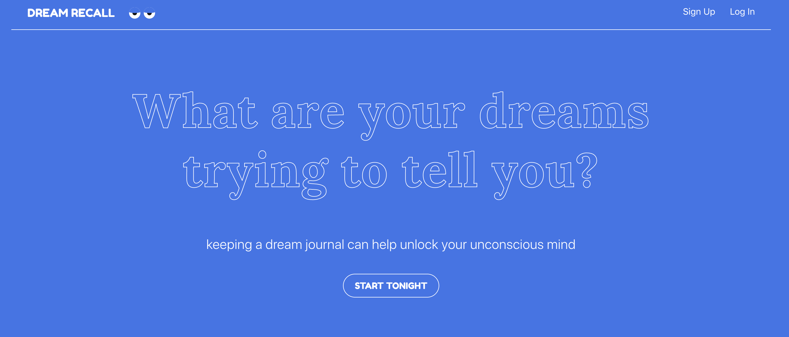
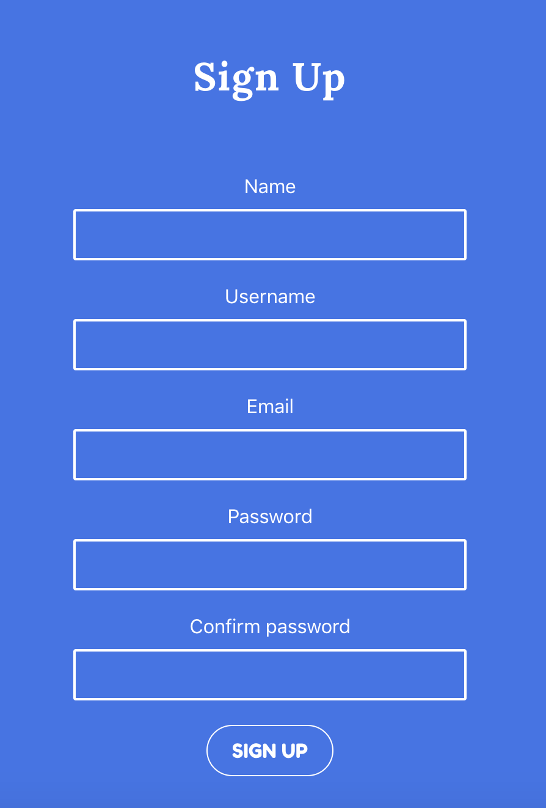
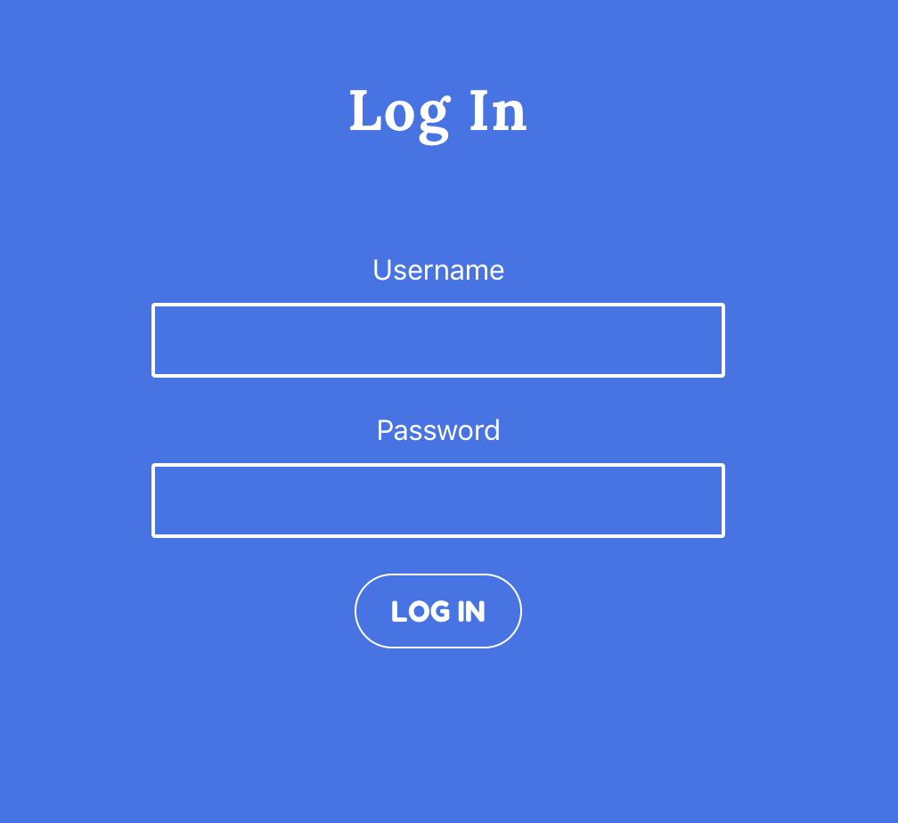
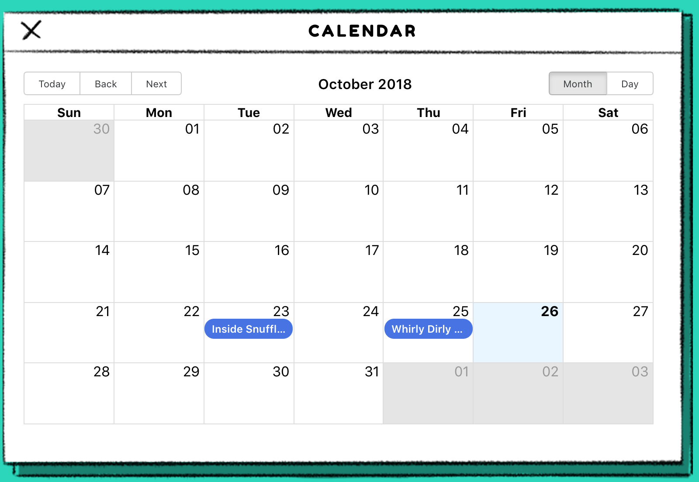
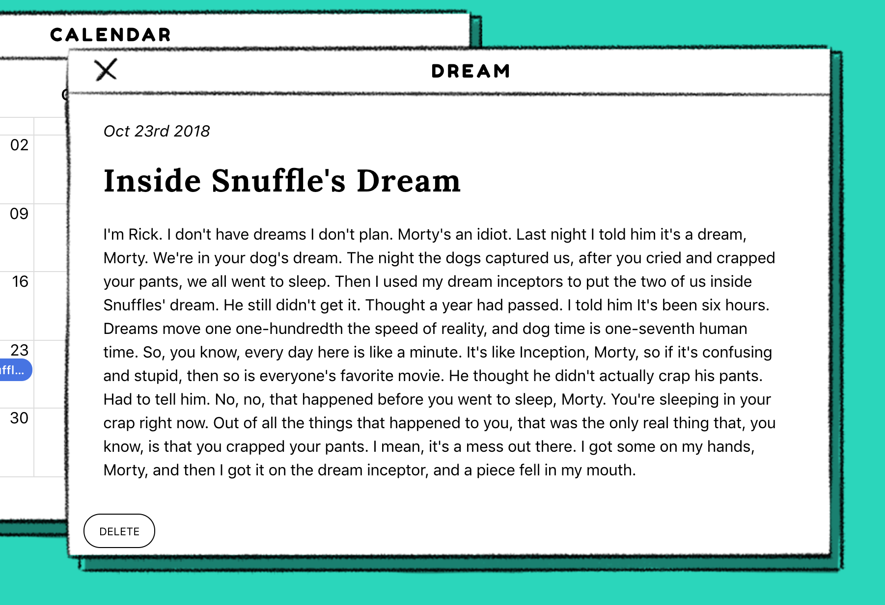
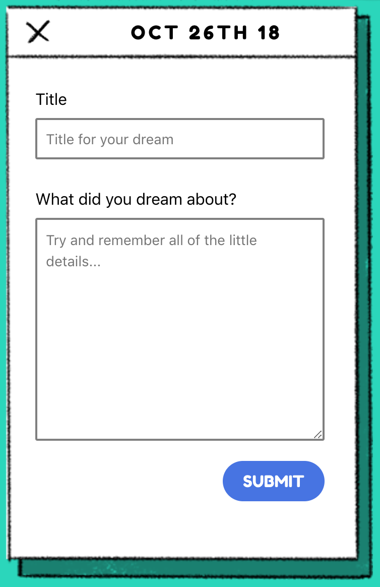

Dream Recall at it's core is a dream journal, but it's also so much more. When you sign up you'll be automatically logged into your own custom Dream Desktop where you'll find the tools you need to record, revisit, and understand your dreams. Writing down your dreams as soon as you wake up dramatically increases your ability to remember details and it's what's in the details that really matter.

Understanding your dreams can be crucial to your emotional and mental health. Dreams are means by which we solve problems and deal with deep emotions and lingering thoughts. Help bring clarity to your dreams.

Let your Dream Desktop be the hub for your unconscious mind.

[Dream Recall](https://dream-recall.herokuapp.com/)

## Table of Contents

- [Tech Stack](#tech-stack)
- [Screenshots](#screenshots)
- [Description of Key Parts of Project](#key-parts)
  - [Client Folder Structure](#client-folder-structure)
  - [Server Folder Structure](#server-folder-structure)
- [Future Features](#future-features)
- [Feedback](#feedback)

## Tech Stack

This project was built with the following:

- `React` for the frontend
- `Redux` for state management
- `Node` for the backend
- `MongoDB` for the database
- `JWTs` for authentication

## Screenshots

**_Home Page_**
Entry point into the site


**_Sign Up_**
Sign up form


**_Login_**
Login form


**_Dashboard Dock Navigation_**
Navigation for the dream dashboard that allows the user to access the different views


**_Calendar View_**
The calendar allows the user to easily access their past dreams based on date


**_Dream Post View_**
The dream post itself opens after clicking on the dream within the calendar view


**_Add a Dream Form_**
The notepad icon opens the add a dream form.  


## Description of Key Parts of Project

The authorization and user creation happens in the auth and users actions and reducers connected to the signupForm and loginForm components and connected to their respective server side models. The journaling aspect of the project is very straight forward. There are post actions and a reducer which connect to the calendar, postForm, postFormContent, and postView components. The server side post endpoint manages the creation and deletion of posts.

### Client Folder Structure

```
public/
  favicon.ico
  index.html
  manifest.json
  src/
    _actions/
      auth.action.js
      dashboard.action.js
      post.action.js
      protected-data.js
      users.action.js
      utils.js
    _components/
      calendar.component.js
      dashNavigation.component.js
      dockNav.component.js
      footer.component.js
      input.component.js
      loginForm.component.js
      navigation.component.js
      postForm.component.js
      postFormContent.component.js
      postView.component.js
      requiresLogin.component.js
      signupForm.component.js
    _containers/
      dashboard.contanier.js
      login.container.js
      signup.container.js
    _reducers/
      auth.reducer.js
      dashboard.reducer.js
      post.reducer.js
      protected-data.js
    css/
      index.css
    imgs/
    pages/
      home.js
      notFound.js
    utils/
      local-storage.js
      serviceWorker.js
      validators.js
    App.router.js
    config.js
    index.css
    index.js
    store.js
  ss/
  package-lock.json
  package.json
  README.md
  static.json
```

### Server Folder Structure

```
auth/
  auth.router.js
  auth.strategy.js
db/
  seed/
    posts.js
    users.js
post/
  post.model.js
  post.router.js
test/
  post.test.js
user/
  user.model.js
  user.router.js
config.js
db.mongoose.js
package-lock.json
package.json
server.js
```

## Future Features

- Data analysis on each dream post that uses IBM's Watson Natural Language API to pull out emotions and general themes in each.
- Overview of data analysis on a weekly and ongoing basis to see patterns in your dreams.
- Dream dictionary that gives you ideas around general meaning for the themes that keep coming up.

## Feedback

I am always open to [your feedback](https://github.com/clkent/dreams-client/issues) or feature requests. Thanks for checking out Dream Recall!
